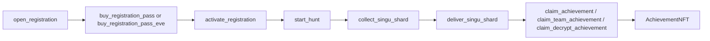
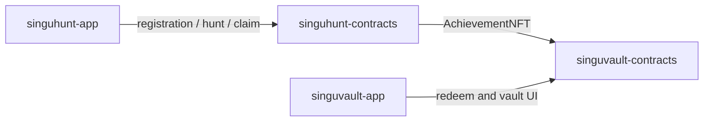

# Singu Hunt Contracts

Sui Move contracts for the Singu Hunt game loop.

This repository contains the current on-chain gameplay layer for Singu Hunt, including registration, EVE-denominated entry fees, multi-mode hunt logic, shard collection and delivery, achievement minting, ticket verification, and bulletin-board support for the in-world SSU flow.

No production links are included in this README.

## English

### What This Package Does

- opens and closes registration windows
- sells `RegistrationPass` objects
- supports an EVE-denominated registration path
- runs daily hunt state and gate selection
- tracks shard collection and delivery
- supports solo race, team race, deep decrypt, large arena, and obstacle run modes
- mints `AchievementNFT`
- provides SSU bulletin-board support

### Repository Layout

`move-contracts/singuhunt/sources/singuhunt.move`
Core game state, registration, hunt lifecycle, shard collection, shard delivery, and mode-specific achievement claim logic.

`move-contracts/singuhunt/sources/achievement_token.move`
Achievement treasury and token primitives.

`move-contracts/singuhunt/sources/singu_shard_token.move`
Shard treasury and token primitives used during live hunt sessions.

`move-contracts/singuhunt/sources/sig_verify.move`
Ticket-signature verification helpers.

`move-contracts/singuhunt/sources/bulletin_board.move`
Bulletin-board state used by the SSU-style in-world interaction surface.

### Main Objects

`GameState`
Shared state object storing epoch, active hunt window, configured gates, ticket signer, registration data, fee data, and cumulative counters.

`RegistrationPass`
Transferable pass bought during registration and later consumed by `activate_registration`.

`SinguShardRecord`
Per-player progress object representing shard state for the current epoch.

`AchievementNFT`
Permanent achievement object minted to successful players.

`AdminCap`
Admin capability used to configure gates, signer, registration windows, and hunt control.

### Supported Modes

The package currently defines five modes:

- `1` solo race
- `2` team race
- `3` deep decrypt
- `4` large arena
- `5` obstacle run

Current registration fee constants are all `1 EVE` in smallest units:

- `REG_FEE_SOLO_RACE = 1_000_000_000`
- `REG_FEE_TEAM_RACE = 1_000_000_000`
- `REG_FEE_DEEP_DECRYPT = 1_000_000_000`
- `REG_FEE_LARGE_ARENA = 1_000_000_000`
- `REG_FEE_OBSTACLE_RUN = 1_000_000_000`

### Main Entry Functions

Admin-side:

- `set_start_gate`
- `set_end_gate`
- `set_pool_gate`
- `set_shard_gate`
- `set_ticket_signer`
- `set_required_singu_count`
- `open_registration`
- `withdraw_registration_fees`
- `finalize_team_registration`
- `start_hunt_with_selection`
- `start_hunt`
- `expire_hunt`

Player-side:

- `buy_registration_pass`
- `buy_registration_pass_eve<T>`
- `activate_registration`
- `collect_singu_shard`
- `deliver_singu_shard`
- `claim_achievement`
- `claim_team_achievement`
- `claim_decrypt_achievement`

Bulletin-board:

- `create_bulletin`
- `update_motd`
- `visit_bulletin`

### Contract Flow

```text
admin opens registration
  -> player buys RegistrationPass
  -> player activates registration
  -> admin finalizes teams if mode requires it
  -> admin starts hunt
  -> players collect and deliver shards
  -> successful players claim AchievementNFT
```



### Frontend / App Relationship

- `singuhunt-app`
  Player-facing frontend for registration, hunt participation, shard interaction, and claim flow.
- `singuvault-contracts`
  Later redemption destination for `AchievementNFT`.
- `singuvault-app`
  Player-facing frontend that redeems the achievement after it is earned here.



### Current App-Side Config Surface

The current `singuhunt-app` expects env / config values for:

- `VITE_GAME_STATE_ID`
- `VITE_SINGUHUNT_PACKAGE_ID`
- `VITE_SINGUHUNT_CALL_PACKAGE_ID`
- `VITE_EVE_COIN_TYPE`
- `VITE_SUI_RPC_URL`
- `VITE_TICKET_API_URL`

Common object IDs expected by the frontend:

- `SINGU_SHARD_TREASURY_ID`
- `ACHIEVEMENT_TREASURY_ID`
- shared `GAME_STATE_ID`

If the package or shared objects are republished, update the frontend env values before release.

### Integration Notes

- `Move.toml` depends on the local `singuvault` package.
- `singuhunt.move` now imports `singuvault::eve::EVE`.
- `buy_registration_pass_eve<T>` enforces the configured EVE coin type and forwards the fee to `REGISTRATION_FEE_RECEIVER`.
- `buy_registration_pass` now also consumes `Coin<EVE>`.
- The achievement image path is hardcoded in code and should stay aligned with the frontend asset path.

### Build And Publish

```bash
cd move-contracts/singuhunt
sui move build
sui client publish --gas-budget 200000000
```

Current `Move.toml` references:

- Sui framework `testnet-v1.66.2`
- local dependency `../../../singuvault-contracts/move-contracts/singuvault`

## 中文

### 這個合約包現在負責什麼

- 開啟與關閉報名窗口
- 發售 `RegistrationPass`
- 支援以 EVE 支付報名費
- 管理每日 hunt 狀態與 gate 配置
- 記錄 shard 收集與交付
- 支援五種模式：Solo Race、Team Race、Deep Decrypt、Large Arena、Obstacle Run
- 鑄造 `AchievementNFT`
- 提供 SSU bulletin board 狀態

### 主要物件

`GameState`
共享遊戲狀態，保存 epoch、hunt 時間、gate、ticket signer、報名狀態與費用資料。

`RegistrationPass`
玩家報名購買後拿到的通行物件，之後會被 `activate_registration` 消耗。

`SinguShardRecord`
玩家在當前 epoch 的 shard 進度物件。

`AchievementNFT`
成功通關後鑄造的永久成就物件。

`AdminCap`
管理員能力物件，用於設定 gate、signer、報名與 hunt 控制。

### 與其他倉庫的關係

- `singuhunt-app`
  直接呼叫本倉庫的 entry functions，提供玩家報名、收集、交付與 claim 體驗
- `singuvault-contracts`
  之後會接收本倉庫鑄造出的 `AchievementNFT`
- `singuvault-app`
  玩家拿到 Achievement 後，去這個前端選擇兌換或質押路徑

### 前端部署時要對齊的設定

重新發版或重建 shared object 時，至少要同步更新 `singuhunt-app`：

- `VITE_GAME_STATE_ID`
- `VITE_SINGUHUNT_PACKAGE_ID`
- `VITE_SINGUHUNT_CALL_PACKAGE_ID`
- `VITE_EVE_COIN_TYPE`
- `VITE_TICKET_API_URL`
- `SINGU_SHARD_TREASURY_ID`
- `ACHIEVEMENT_TREASURY_ID`

### 部署

```bash
cd move-contracts/singuhunt
sui move build
sui client publish --gas-budget 200000000
```

## License

Copyright (c) Eve U Luv Me. All rights reserved.

This repository is proprietary and is not licensed under MIT.
